# Pizza Shop

## About

This VM was created by team Eternal Pizza representing Seneca College/Ontario for the CyberSci 2020 Nationals online CTF. 

## Challenge Roadmap <a name="roadmap"> </a>

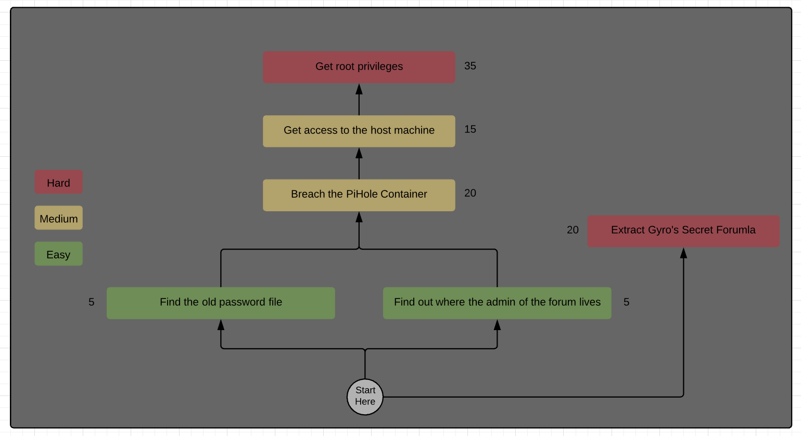

This VM has 6 challenges totaling 100 points. The challenges are split up by their difficulty, as well as the the order of their completion. 

| Challenge | Difficulty | Score Value |
| :-------- | :--------: | :---------: |
| [Find out where the admin of the forum lives](#ch1) | Easy | 5 points |
| [Find the old password file](#ch2) | Easy | 5 points |
| [Breach the PiHole Container](#ch3) | Medium | 20 points |
| [Get access to the host machine](#ch4) | Medium | 15 points |
| [Get root privileges](#ch5) | Hard | 35 points |
| [Extract Gryo's Secret Formula](#ch6) | Hard | 20 points |

## Challenge Solutions

Before doing any of the challenges, visit the post on the wordpress titled "Pizza Shop Scavenger Hunt" to know how to submit challenges and get some hints.

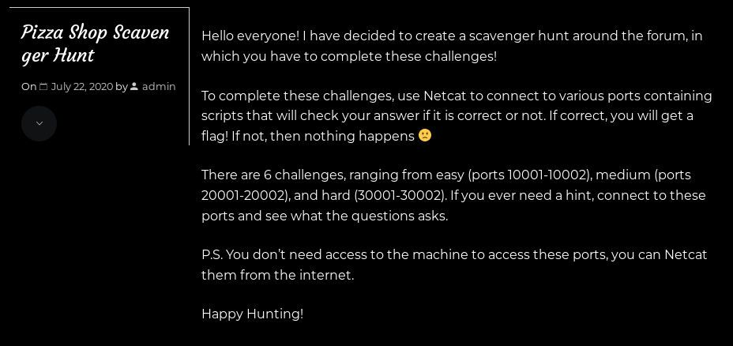

### Find out where the admin of the forum lives <a name="ch1" ></a>

To solve this challenge, look around the posts on the wordpress, and see which ones are posted by the admin. There's the CTF preface post (but it doesn't reveal anyting, or give us anything to work with). 

There's another post by admin titled "My Favourite Toppings". Looking at the post, it doesn't seem to give any information away regarding location either, however it might become useful later on.

The final post by admin titled "Post your Pizzas!" gives us something to work with. 

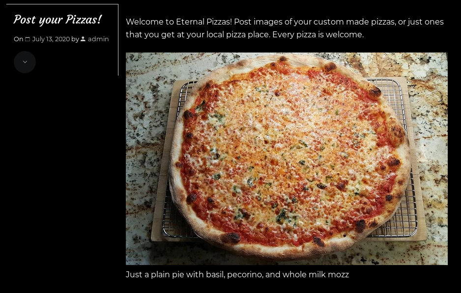

The post itself contains an image of a pizza seemingly made by the admin, so what we can do is inspect the image and see if there are any clues left to the admins location. The first thing we can do is look at exif data. 

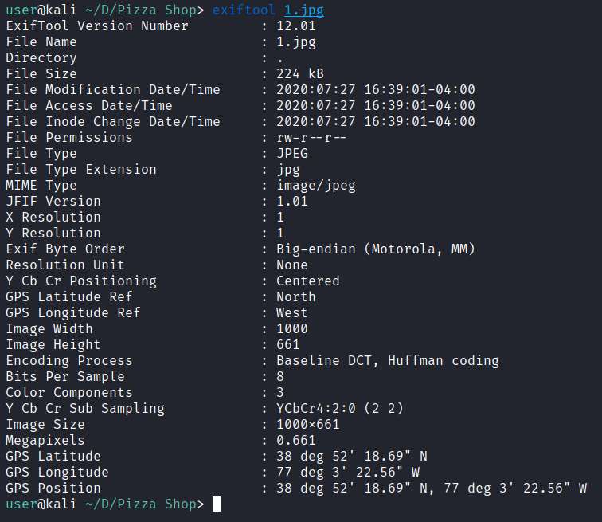

Downloading the image and running it through `exiftool`, we notice that the image comes with GPS coordinates. You can use [this](https://www.gps-coordinates.net/) website to get the location of any given coordinates.

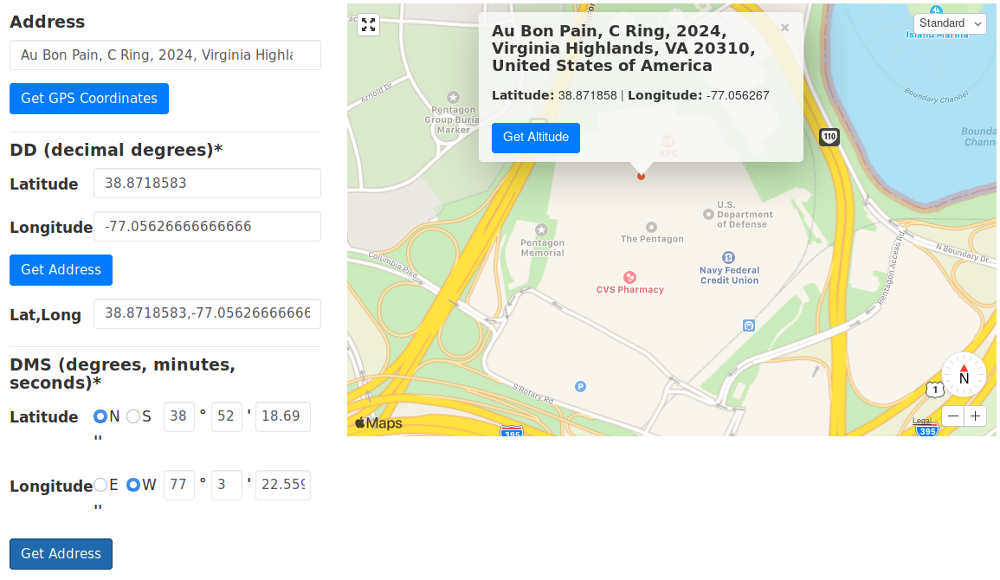

Finding the location of the given coordinates, we see that they lead to The Pentagon. 

Entering "pentagon" into port 10001 gives us the first flag. 

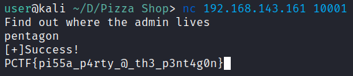

The input needed to complete this challenge is `pentagon` which yields the flag `PCTF{pi55a_p4rty_@_th3_p3nt4g0n}`

## Find the old password file <a name="ch2"> </a>

This challenge is pretty vague, but one place we can start looking (as anyone should when presented with a web server) is hidden directories. You can manually type in some common hidden directories such as `robots.txt`, or use fuzzing tool `dirb`. I named the hidden directory after a result that could be found in one of the default wordlists for `dirb`. 

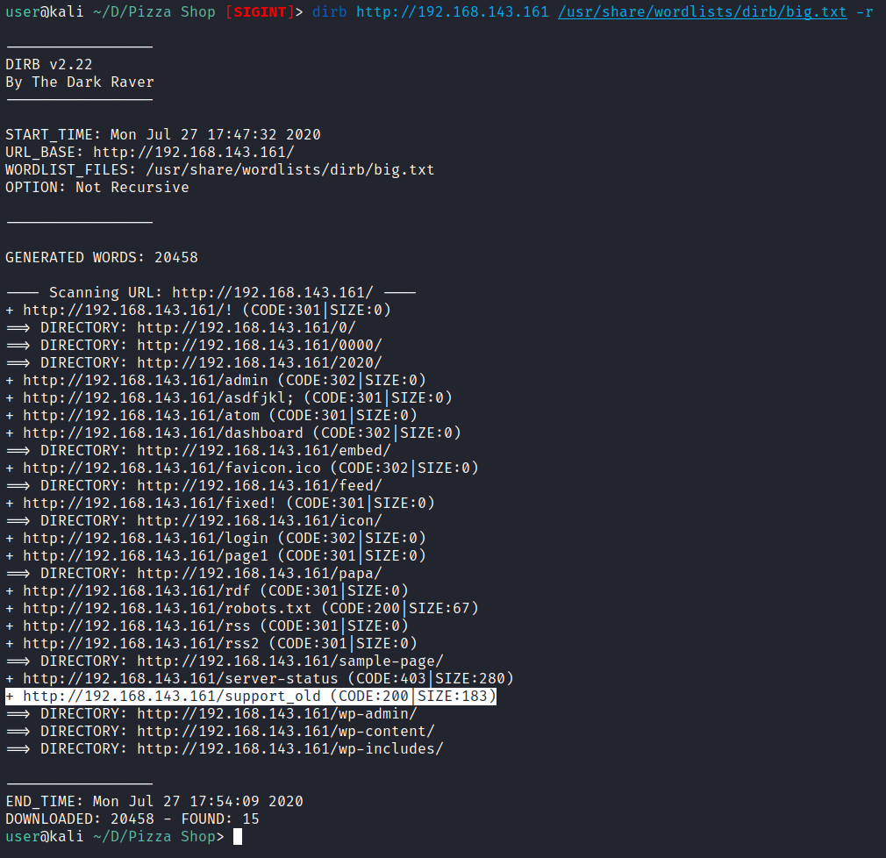

Reading the results, the one to look out for is `support_old`. 

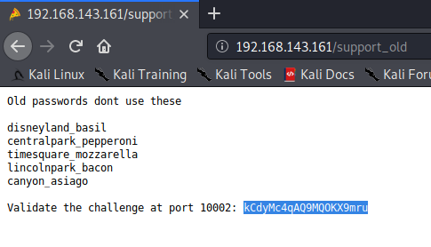

Entering this result into the URI, we see an old password list, along with input that can be used to get the flag for the second challenge. 

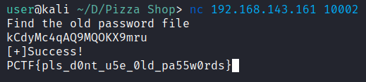

The input needed to complete this challenge is `kCdyMc4qAQ9MQOKX9mru` which yields the flag `PCTF{pls_d0nt_u5e_0ld_pa55w0rds}`

### Breach the PiHole Container <a name="ch3"> </a>

If we scan port 443 of the machine, we don't get much valuable information. 

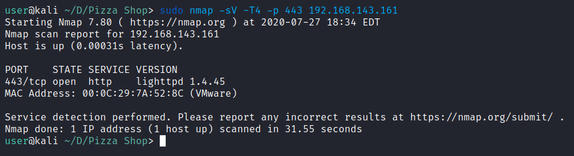

However, once we visit port 443, we get an error message.

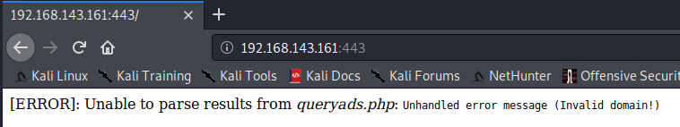

To find out more, we can fuzz the website once again (this time on port 443), and get some results to work with. 

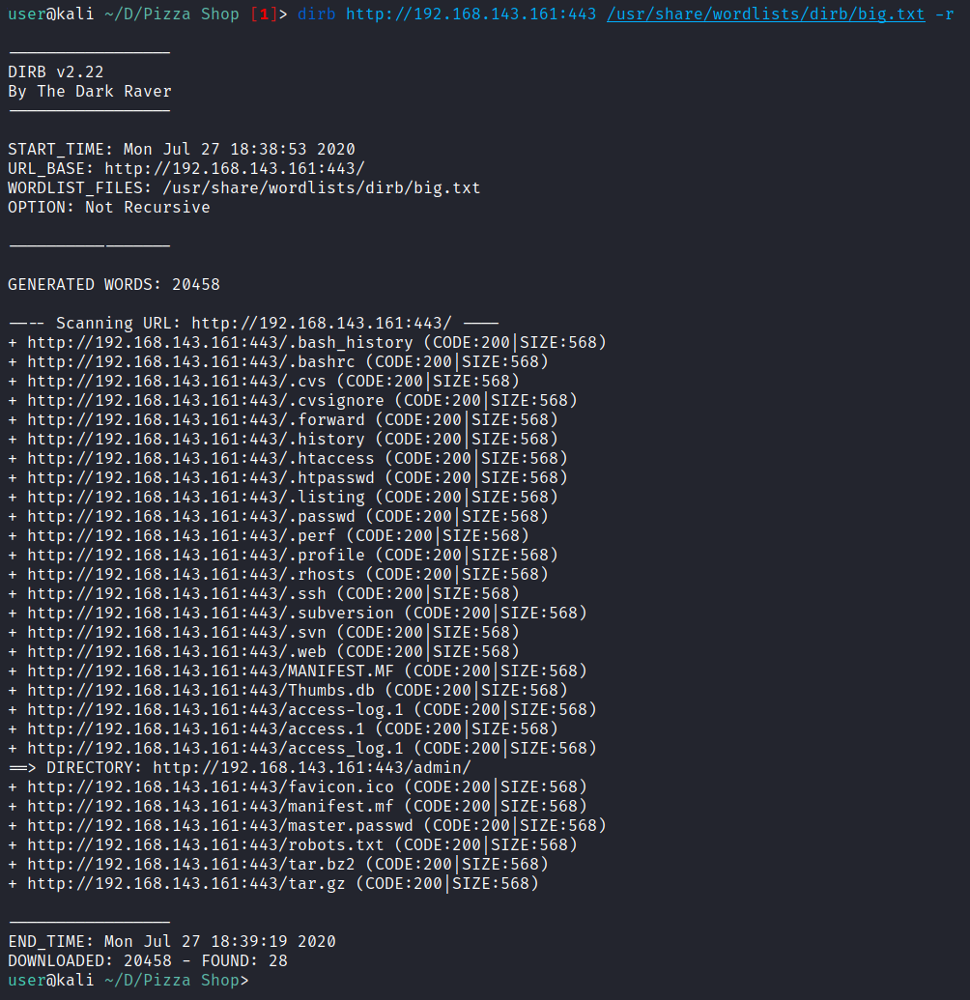

You can go through all of the files listed, some will give you clues and some won't. However, we need to go to the directory that was found in order to move forward. Going to `/admin/`, shows us the web interface for PiHole. 

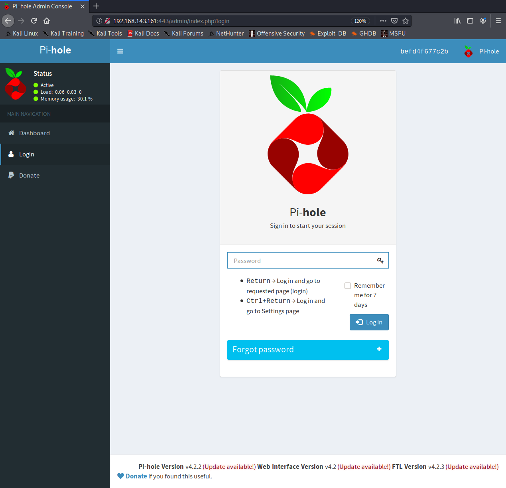

Along with that, we see a login screen that only takes a password, and no username. At this point, you can try brute forcing the login using the rockyou password list, or any other common credential dump; but I created the challenge to include pieces from other challenges. If you refer back to the [challenge roadmap](#roadmap), we see that the first two challenges need to be completed in order to complete this challenge. The solution here is to deduct the admins password based on the old password list (giving away the password schema), the location of the where the admin lives, and the admins favourite topping. 

Knowing this, we see that the old password list has passwords using a combination of a place, followed by an underscore, and then a pizza topping. During the [first challenge](#ch1), we figured out that the admin lives in the pentagon, so we'll use that as our place. Next, we know that pineapple is the admins favourite topping, so we can use that as our topping. Combining these strings to fit the password format, we can log into the web interface. 

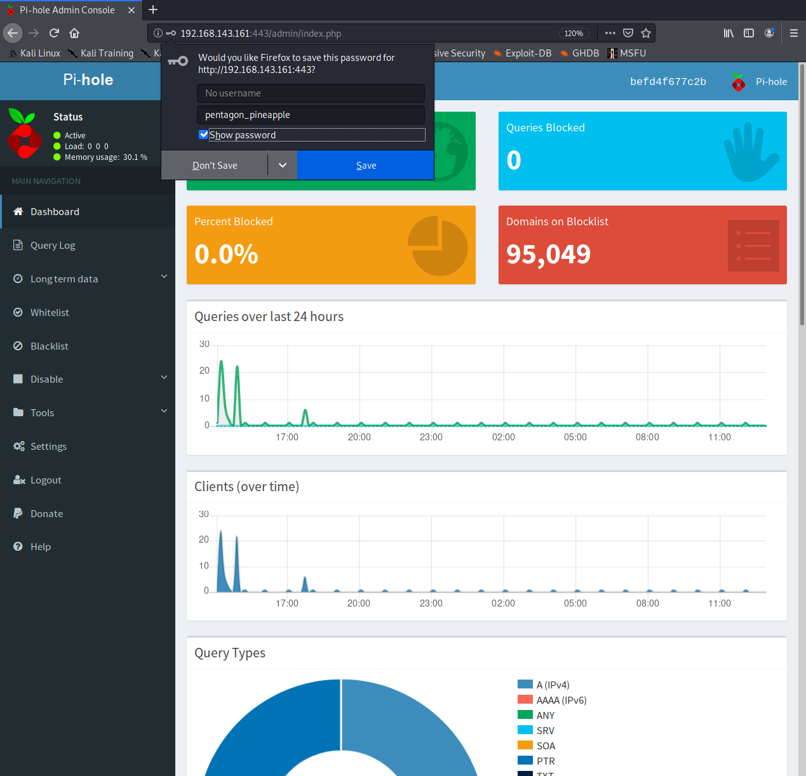

However, the challenge itself is not solved. In order to solve the challenge, we need to breach the container running the PiHole service. Fortunately, this version of PiHole has a few vulnerabilities we can exploit in order to achieve RCE and obtain a shell. In this solution, we'll exploit [CVE-2020-8816](https://cve.mitre.org/cgi-bin/cvename.cgi?name=CVE-2020-8816) using [this PoC](https://github.com/AndreyRainchik/CVE-2020-8816). 

To run this exploit, we'll need a working PiHole user-interface password (which we already got), as well as a server with an open port for the reverse shell. In the event of an online competition, I would recommend spinning up an EC2 instance (or any other type of cloud VM), and port forwarding the port you're planning to use for the shell. 

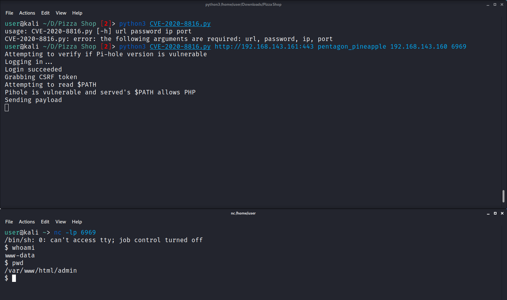

The hint for the third challenge is to "go home and check me", this means that you'll have to go to the home directory once you've breached the PiHole, and `cat` the file with the validation text. 

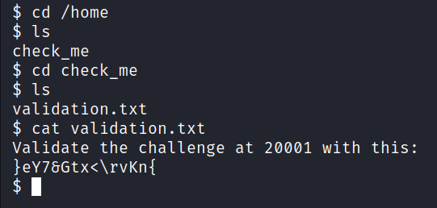

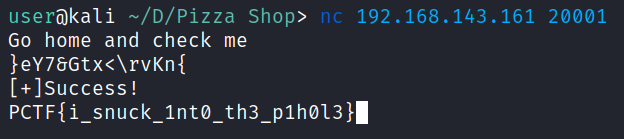

The input needed to complete this challenge is `}eY7&Gtx<\rvKn{` which yields the flag `PCTF{i_snuck_1nt0_th3_p1h0l3}`

### Get access to the host machine <a name="ch4"> </a>

Now that we're in the PiHole container, we're going to have to find a way to either escape the container, or a way to log into the host machine via SSH. The intended route to solve this challenge is to use reconnaissance commands that are often used after getting a shell into another machine, such as `find` or `grep`. 

In this solution, I used the command `grep -iR "passwd" /`. Using this command, you'll find that a global variable has been set in a script located at `/usr_sbin/backup_files.sh` by the careless IT admin. 

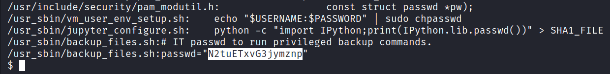

We can figure out who the IT admin is by browsing the posts on the wordpress. More specifically, the main post titled "Pizza Shop Scavenger Hunt" hints at who the IT admin is in the comments.

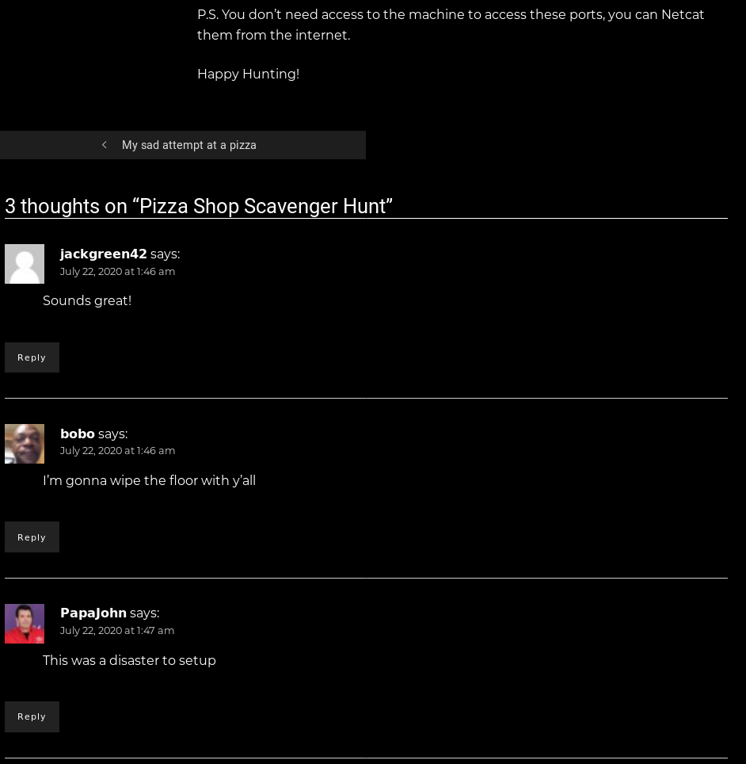

Assuming the IT admin is PapaJohn, we can try logging into SSH using his username, and the password we found in the backup script. 

We can log into the host machine using the `papajohn` username through SSH to make sure we have the right credentials. Once that's done, validate the password on port 20002, and get the flag. 

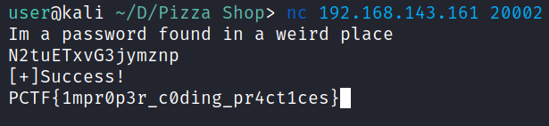

The input needed to complete this challenge is `}eY7&Gtx<\rvKn{` which yields the flag `PCTF{i_snuck_1nt0_th3_p1h0l3}`

### Get root privileges <a name="ch5"> </a>

Once we're logged into `papajohn` on the host machine, we notice that we don't have many privileges. However, we see that this user is in the sudo group, but is not allowed to execute any sudo command, other than `bash`. 

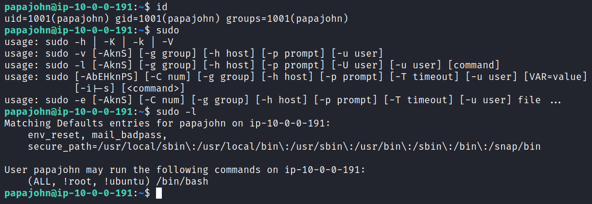

Checking the version of sudo, we see that it is outdated, and that there are a few vulnerabilities we can exploit in order to escalate privileges to root. 

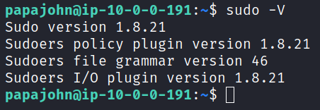

In this solution, we're going to exploit [CVE-2019-14287](https://nvd.nist.gov/vuln/detail/CVE-2019-14287) using this [PoC](https://www.exploit-db.com/exploits/47502). The exploit itself is easy, just enter the following sudo command to get a privileged shell: `sudo -u#-1 /bin/bash`

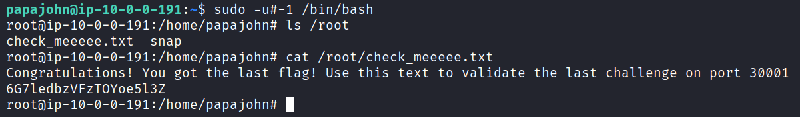

We can put this string into port 30002 to get the final flag. 

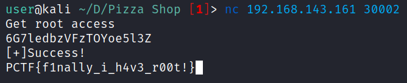

The input needed to complete this challenge is `N2tuETxvG3jymznp` which yields the flag `PCTF{1mpr0p3r_c0ding_pr4ct1ces}`

### Extract Gyro's Secret Formula <a name="ch6"> </a>

For this challenge, go to the wordpress post titled "Gyro's Magic Ingredients", and download the linked binary (if the link doesn't work, just use the one in this repo). In the post, the author (Gyro) mentions that he hates virtual machines. The purpose of mentioning this, is that the binary has a few Anti-Reverse Engineering mechanism in place that will shutdown your computer if it detects that it's being run in a sandbox environment. Sometimes there are false positives, and the binary might shut down your host. In any case, **do not** run the binary, it's not necessary at all. 

First, open the binary in Ghidra or Ida Pro for static analysis (be sure to include the `.pdb` file to make the analysis easier). Running `strings` doesn't give us too many useful results, apart from an encoded string near the interactive strings used to tell you whether your input was correct or wrong. 

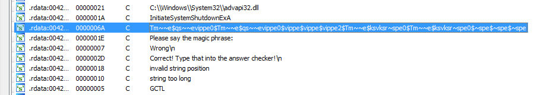

We can cross-reference this string to the `beginSecretCheck()` function located at `0x402530` (the offset may be different if you aren't using Ida Pro). This function is called from `main()`, after it passes a series of checks that determine whether or not the host is a virtual machine. 

The function `cpuidHypervisorCheck()` checks to see if the CPU is virtual, or physical. It does this by calling the `cpuid` instuction, and checking to see if the 31st bit is 1. 

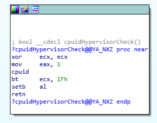

According to the [Intel manual](https://en.wikipedia.org/wiki/CPUID), the 31st bit of the `cpuid` instruction indicates whether or not the CPU is physical. 

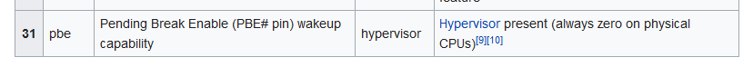

If this check fails, then the executable calls `InitiateSystemShutdownExA` (assuming it has the permissions), and shuts down the system it's running on. 

The other functions that perform the restr of the Anti-RE checks include `isMacAddressBlacklisted()`, which calls `GetAdaptersInfo()` to get the systems MAC address, and then match it to the blacklisted MAC address prefixes known to be given to VMware VMs. 

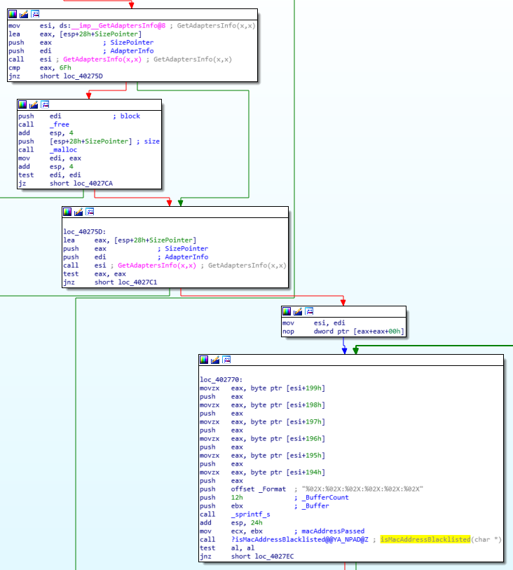

Bypassing/Evading these checks is unnecessary, all we have to do is analyse how `beginSecretCheck()` encodes our user input. 

Looking at this function, we see that first our input length is checked to be equal to the length of the encoded string, otherwise it tells us our input is incorrect. The correct length of the input must be 24 bytes.  

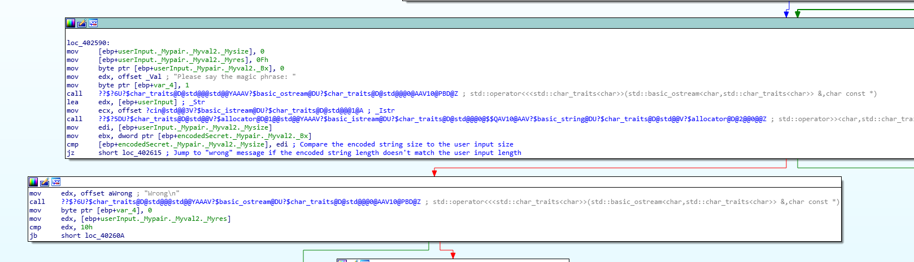

After our input matches the length of the encoded string, it goes into loop. What this loop does, is add 4 to the decimal value each character of our user input in `ecx`, and then match the new modified user input to the original encoded string. If any modified character in our user input does not match the corresponding character in the encoded string, the binary stops the loop and exits.  

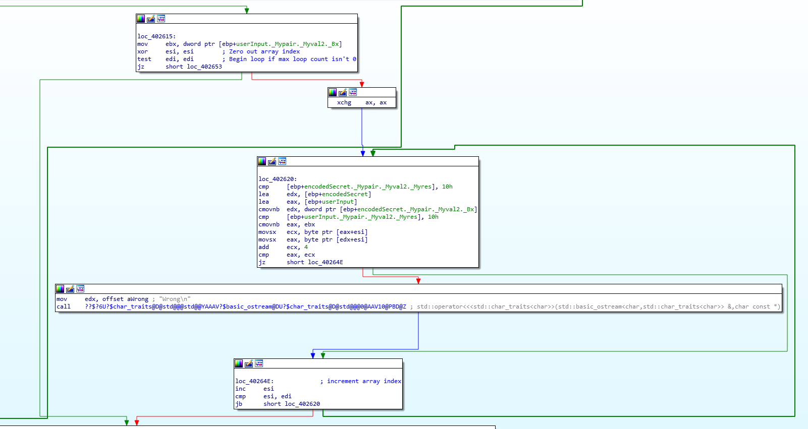

In order to reverse engineer the correct input, we'll have to do the opposite of what the binary is doing with our input; subtract the decimal value of 4 from each character in the encoded string. You can do this manually using a [Standard ASCII table](https://www.commfront.com/pages/ascii-chart), or just write a simple Python script.

```python
#!/usr/bin/python3
encoded_string = "Tm~~e$qs~~evippe0$Tm~~e$qs~~evippe0$vippe$vippe$vippe2$Tm~~e$ksvksr~spe0$Tm~~e$ksvksr~spe0$~spe$~spe$~spe"
decoded_string = ""

for character in encoded_string:
  decoded_string += chr(ord(character)-4)
  
print(decoded_string)
```

The result ends up being `Pizza mozzarella, Pizza mozzarella, rella rella rella. Pizza gorgonzola, Pizza gorgonzola, zo
la zola zola`, which we can put into port 30001, and get the flag. 

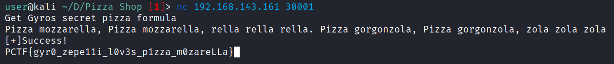

The input needed to complete this challenge is `Pizza mozzarella, pizza mozzarella, rella rella rella. Pizza gorgonzola, pizza gorgonzola, zola zola zola` which yields the flag `PCTF{gyr0_zepe11i_l0v3s_p1zza_m0zareLLa}`